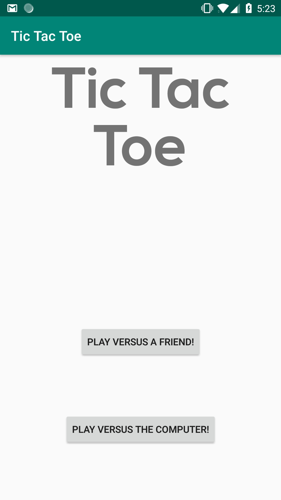
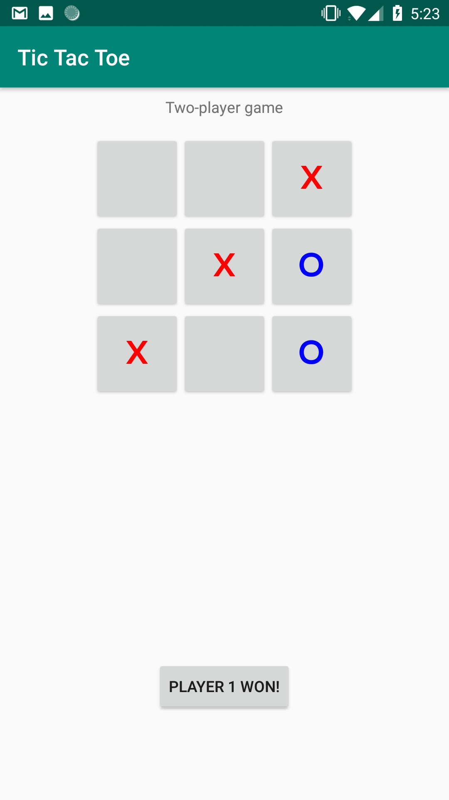
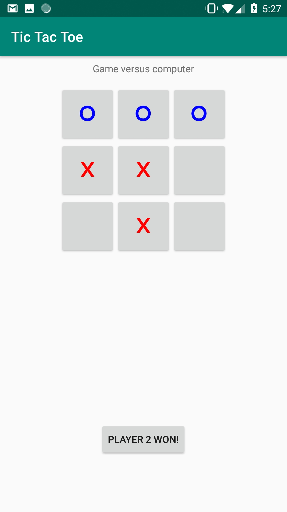

Tic-Tac-Toe by Ivo de Brouwer 11045841

Extra features:
- Lets the user play against the computer.
- Allows the user to choose either a two-player game or play against the computer.
- Uses large, color-coded text for crosses/circles.

Images:

Title screen                 | Two-player-game              | Game versus computer        
:---------------------------:|:----------------------------:|:----------------------------:|
          |           |           |

